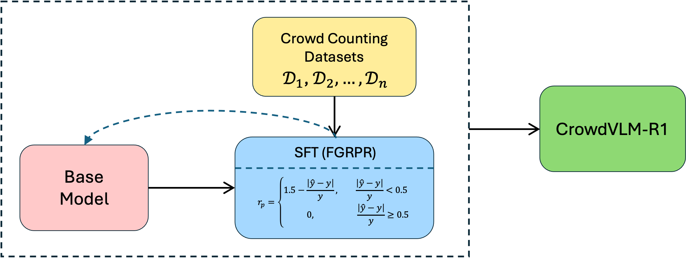
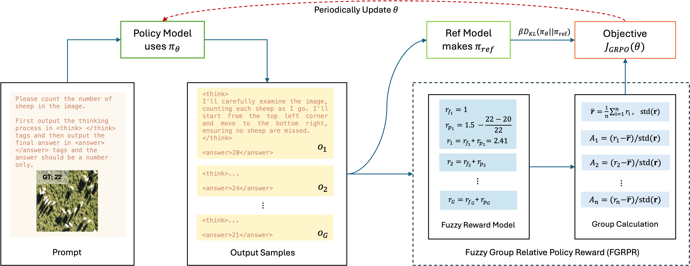

# CrowdVLM-R1

> We propose Fuzzy Group Relative Policy Reward (FGRPR), a novel framework that integrates Group Relative Policy Optimization (GRPO) with a fuzzy reward function to enhance learning efficiency. Unlike the conventional binary 0/1 accuracy reward, our fuzzy reward model provides nuanced incentives, encouraging more precise outputs. Experimental results demonstrate that GRPO with a standard 0/1 accuracy reward underperforms compared to supervised fine-tuning (SFT). In contrast, FGRPR, applied to Qwen2.5-VL(3B and 7B), surpasses all baseline models, including GPT4o, LLaMA2(90B), and SFT, across five in-domain datasets. On an out-of-domain dataset, FGRPR achieves performance comparable to SFT but excels when target values are larger, as its fuzzy reward function assigns higher rewards to closer approximations. 

## Framekwork

||
|:-:|
|*The general ideal of our proposed framework*|

||
|:-:|
|*The detail framework of utilizing GPRO with our fuzzy reward function*|

### Dataset

[Dataset from Google Drive](https://drive.google.com/file/d/1vPNnTv_PFLeDXyFJzWhqtlHfxKW3juIO/view?usp=sharing)

We have a bigger dataset version with more training images while keeping the testing images the same, if you like to have it, feel free to contact me.

||
|:-:|
|*Image samples from dataset*|

### Training

Our project is based on [VLM-R1](https://github.com/om-ai-lab/VLM-R1) while we changed the reward functions within `src/open_r1/grpo_rec.py`: `count_reward`, `count_format_reward`.

You can train model with our dataset with this project directly. At the same time, their project had been updated, with files re-organized, after our experiement, you may copy these two functions to their latest code for better experiement.

### Citation
If you think our dataset and project is useful, please cite our paper:
> @misc{wang2025crowdvlmr1expandingr1ability,
      title={CrowdVLM-R1: Expanding R1 Ability to Vision Language Model for Crowd Counting using Fuzzy Group Relative Policy Reward}, 
      author={Zhiqiang Wang and Pengbin Feng and Yanbin Lin and Shuzhang Cai and Zongao Bian and Jinghua Yan and Xingquan Zhu},
      year={2025},
      eprint={2504.03724},
      archivePrefix={arXiv},
      primaryClass={cs.CV},
      url={https://arxiv.org/abs/2504.03724}, 
}

And VLM-R1 paper:
> @misc{shen2025vlmr1,
    author       = {Shen, Haozhan and Zhang, Zilun and Zhang, Qianqian and Xu, Ruochen and Zhao, Tiancheng},
    title        = {VLM-R1: A stable and generalizable R1-style Large Vision-Language Model},
    howpublished = {\url{https://github.com/om-ai-lab/VLM-R1}},
    note         = {Accessed: 2025-02-15},
    year         = {2025}
}
